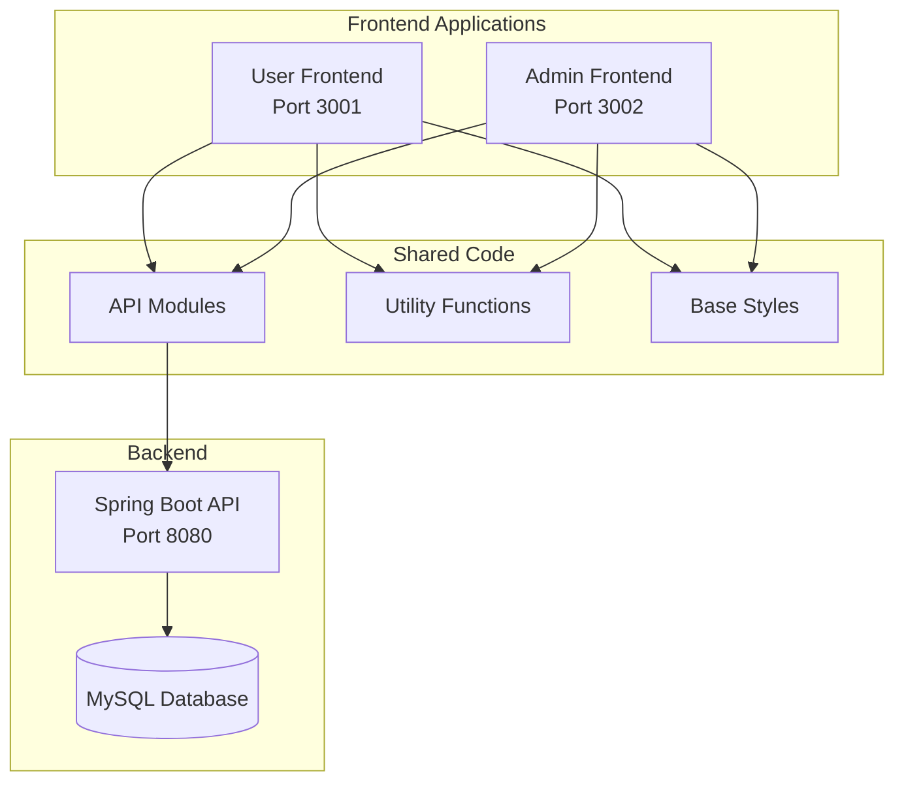

# Design Document: Admin/User Frontend Separation

## Overview

将健身管理系统的前端分离为两套独立的Vue.js应用：用户端（User Frontend）和管理端（Admin Frontend）。两个应用共享公共代码（API、工具函数、基础样式），但拥有独立的路由、视图和入口文件，分别运行在不同端口。

## Architecture



## Components and Interfaces

### 项目目录结构

```
Fitness/
├── frontend/                    # 用户端前端 (Port 3001)
│   ├── src/
│   │   ├── views/              # 用户端视图
│   │   ├── components/         # 用户端组件
│   │   ├── router/             # 用户端路由
│   │   ├── stores/             # 用户端状态管理
│   │   ├── App.vue
│   │   └── main.js
│   ├── package.json
│   └── vite.config.js
│
├── admin/                       # 管理端前端 (Port 3002)
│   ├── src/
│   │   ├── views/              # 管理端视图
│   │   │   ├── AdminDashboard.vue
│   │   │   ├── UserManagement.vue
│   │   │   ├── SystemStats.vue
│   │   │   ├── AuditLogs.vue
│   │   │   ├── SystemSettings.vue
│   │   │   └── AdminLogin.vue
│   │   ├── components/         # 管理端组件
│   │   ├── router/             # 管理端路由
│   │   ├── stores/             # 管理端状态管理
│   │   ├── App.vue
│   │   └── main.js
│   ├── package.json
│   └── vite.config.js
│
└── shared/                      # 共享代码
    ├── api/                     # API模块
    │   ├── request.js
    │   ├── auth.js
    │   ├── fitness.js
    │   └── admin.js
    ├── utils/                   # 工具函数
    │   ├── message.js
    │   ├── errorHandler.js
    │   └── performance.js
    └── styles/                  # 基础样式
        ├── variables.scss
        ├── mixins.scss
        └── base.scss
```

### 用户端路由配置

```javascript
// frontend/src/router/index.js
const userRoutes = [
  { path: '/login', name: 'Login', component: Login },
  { path: '/', redirect: '/dashboard' },
  { path: '/dashboard', name: 'Dashboard', component: Dashboard },
  { path: '/training-data', name: 'TrainingData', component: TrainingData },
  { path: '/training-plans', name: 'TrainingPlans', component: TrainingPlanDisplay },
  { path: '/nutrition-tracking', name: 'NutritionTracking', component: NutritionTracking },
  { path: '/recovery-status', name: 'RecoveryStatus', component: RecoveryStatus },
  { path: '/training-suggestions', name: 'TrainingSuggestions', component: TrainingSuggestions },
  { path: '/history-stats', name: 'HistoryStatistics', component: HistoryStatistics },
  { path: '/user-profile', name: 'UserProfile', component: UserProfile },
  { path: '/settings', name: 'Settings', component: Settings }
]
```

### 管理端路由配置

```javascript
// admin/src/router/index.js
const adminRoutes = [
  { path: '/login', name: 'AdminLogin', component: AdminLogin },
  { path: '/', redirect: '/dashboard' },
  { path: '/dashboard', name: 'AdminDashboard', component: AdminDashboard },
  { path: '/users', name: 'UserManagement', component: UserManagement },
  { path: '/statistics', name: 'SystemStats', component: SystemStats },
  { path: '/audit-logs', name: 'AuditLogs', component: AuditLogs },
  { path: '/settings', name: 'SystemSettings', component: SystemSettings }
]
```

### API模块接口

```javascript
// shared/api/admin.js
export const adminApi = {
  // 用户管理
  getUsers(params),           // GET /api/v1/admin/users
  getUserById(id),            // GET /api/v1/admin/users/:id
  updateUser(id, data),       // PUT /api/v1/admin/users/:id
  deleteUser(id),             // DELETE /api/v1/admin/users/:id
  
  // 系统统计
  getSystemStats(),           // GET /api/v1/admin/stats
  
  // 审计日志
  getAuditLogs(params),       // GET /api/v1/admin/audit-logs
  
  // 系统设置
  getSettings(),              // GET /api/v1/admin/settings
  updateSettings(data)        // PUT /api/v1/admin/settings
}
```

## Data Models

### 用户角色枚举

```javascript
const UserRole = {
  USER: 'USER',
  ADMIN: 'ADMIN'
}
```

### 审计日志模型

```javascript
const AuditLog = {
  id: Number,
  userId: Number,
  username: String,
  action: String,        // LOGIN, LOGOUT, CREATE, UPDATE, DELETE
  targetType: String,    // USER, TRAINING_RECORD, TRAINING_PLAN, etc.
  targetId: Number,
  details: String,
  ipAddress: String,
  createdAt: DateTime
}
```

### 系统统计模型

```javascript
const SystemStats = {
  totalUsers: Number,
  activeUsers: Number,
  totalTrainingRecords: Number,
  totalTrainingPlans: Number,
  totalNutritionRecords: Number,
  newUsersToday: Number,
  newRecordsToday: Number
}
```

## Correctness Properties

*A property is a characteristic or behavior that should hold true across all valid executions of a system-essentially, a formal statement about what the system should do. Properties serve as the bridge between human-readable specifications and machine-verifiable correctness guarantees.*

### Property 1: Admin Role Redirect on User Frontend

*For any* user with ADMIN role who logs in through the User Frontend, the system should redirect them to the Admin Frontend (port 3002).

**Validates: Requirements 1.5**

### Property 2: Non-Admin Access Rejection on Admin Frontend

*For any* user without ADMIN role who attempts to login through the Admin Frontend, the system should reject the login and display an appropriate error message.

**Validates: Requirements 2.4**

### Property 3: CORS Origin Validation

*For any* HTTP request from an origin not in the allowed list (localhost:3001, localhost:3002), the Backend API should reject the request with appropriate CORS error.

**Validates: Requirements 4.3**

## Error Handling

### 用户端错误处理

1. **认证错误**: Token过期或无效时，重定向到登录页
2. **权限错误**: 用户尝试访问管理功能时，显示"无权限"提示
3. **网络错误**: 显示友好的错误提示，支持重试

### 管理端错误处理

1. **认证错误**: Token过期或无效时，重定向到管理员登录页
2. **权限错误**: 非管理员尝试登录时，显示"仅限管理员访问"错误
3. **操作错误**: 管理操作失败时，显示详细错误信息

## Testing Strategy

### 单元测试

- 测试路由守卫逻辑
- 测试角色判断函数
- 测试API模块

### 集成测试

- 测试用户端登录流程
- 测试管理端登录流程
- 测试角色重定向逻辑

### Property-Based Tests

- 使用fast-check库进行属性测试
- 测试角色验证的边界情况
- 测试CORS配置的正确性

### 测试配置

```javascript
// vitest.config.js
export default {
  test: {
    environment: 'jsdom',
    globals: true,
    coverage: {
      reporter: ['text', 'json', 'html']
    }
  }
}
```
