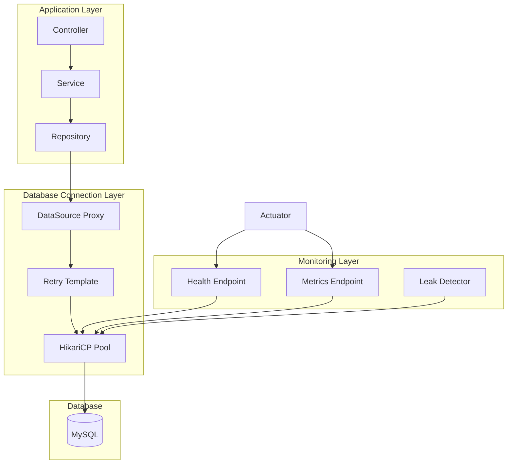

# Design Document: Database Connection Stability

## Overview

本设计文档描述了健身管理系统数据库连接稳定性优化的技术方案。通过优化 HikariCP 连接池配置、实现连接验证机制、添加重试策略和健康检查功能，解决当前系统存在的数据库连接不稳定问题。

### 问题分析

根据系统日志分析，发现以下问题：
1. **Thread starvation or clock leap detected** - HikariCP 连接池检测到线程饥饿
2. 连接池缺少 keepalive-time 配置，导致空闲连接可能失效
3. 缺少 validation-timeout 配置
4. 缺少连接重试机制
5. 健康检查端点未暴露连接池详细指标

### 解决方案概述

1. 优化 HikariCP 连接池配置参数
2. 实现基于 Spring Retry 的数据库连接重试策略
3. 扩展 Actuator 健康检查端点
4. 添加连接池监控指标
5. 优化事务管理配置

## Architecture



## Components and Interfaces

### 1. HikariCP 配置优化

优化后的连接池配置参数：

```properties
# HikariCP 连接池优化配置
spring.datasource.hikari.maximum-pool-size=20
spring.datasource.hikari.minimum-idle=5
spring.datasource.hikari.idle-timeout=300000
spring.datasource.hikari.pool-name=FitnessHikariCP
spring.datasource.hikari.max-lifetime=1200000
spring.datasource.hikari.connection-timeout=30000
spring.datasource.hikari.validation-timeout=5000
spring.datasource.hikari.leak-detection-threshold=60000
spring.datasource.hikari.keepalive-time=120000
spring.datasource.hikari.connection-init-sql=SET NAMES utf8mb4
spring.datasource.hikari.auto-commit=true
spring.datasource.hikari.register-mbeans=true
```

### 2. DatabaseRetryConfig - 重试配置类

```java
@Configuration
@EnableRetry
public class DatabaseRetryConfig {
    
    @Bean
    public RetryTemplate databaseRetryTemplate() {
        RetryTemplate retryTemplate = new RetryTemplate();
        
        // 指数退避策略
        ExponentialBackOffPolicy backOffPolicy = new ExponentialBackOffPolicy();
        backOffPolicy.setInitialInterval(1000);
        backOffPolicy.setMultiplier(2.0);
        backOffPolicy.setMaxInterval(10000);
        retryTemplate.setBackOffPolicy(backOffPolicy);
        
        // 重试策略 - 最多3次
        SimpleRetryPolicy retryPolicy = new SimpleRetryPolicy();
        retryPolicy.setMaxAttempts(3);
        retryTemplate.setRetryPolicy(retryPolicy);
        
        return retryTemplate;
    }
}
```

### 3. DatabaseHealthIndicator - 健康检查指示器

```java
@Component
public class DatabaseHealthIndicator implements HealthIndicator {
    
    private final HikariDataSource dataSource;
    
    @Override
    public Health health() {
        HikariPoolMXBean poolMXBean = dataSource.getHikariPoolMXBean();
        
        Map<String, Object> details = new HashMap<>();
        details.put("activeConnections", poolMXBean.getActiveConnections());
        details.put("idleConnections", poolMXBean.getIdleConnections());
        details.put("totalConnections", poolMXBean.getTotalConnections());
        details.put("threadsAwaitingConnection", poolMXBean.getThreadsAwaitingConnection());
        
        // 检查连接池健康状态
        int activeConnections = poolMXBean.getActiveConnections();
        int maxPoolSize = dataSource.getMaximumPoolSize();
        double utilizationRate = (double) activeConnections / maxPoolSize;
        
        if (utilizationRate > 0.9) {
            return Health.down()
                .withDetails(details)
                .withDetail("warning", "Connection pool utilization > 90%")
                .build();
        } else if (utilizationRate > 0.7) {
            return Health.status("WARNING")
                .withDetails(details)
                .withDetail("warning", "Connection pool utilization > 70%")
                .build();
        }
        
        return Health.up().withDetails(details).build();
    }
}
```

### 4. ConnectionPoolMetricsConfig - 连接池指标配置

```java
@Configuration
public class ConnectionPoolMetricsConfig {
    
    @Bean
    public MeterBinder hikariMetrics(HikariDataSource dataSource) {
        return new HikariCPMetrics(dataSource);
    }
}
```

### 5. DatabaseRetryAspect - 重试切面

```java
@Aspect
@Component
@Slf4j
public class DatabaseRetryAspect {
    
    private final RetryTemplate retryTemplate;
    
    @Around("@annotation(retryable)")
    public Object retryDatabaseOperation(ProceedingJoinPoint joinPoint, Retryable retryable) throws Throwable {
        return retryTemplate.execute(context -> {
            try {
                return joinPoint.proceed();
            } catch (Throwable e) {
                if (isRetryableException(e)) {
                    log.warn("Database operation failed, attempt {}: {}", 
                        context.getRetryCount() + 1, e.getMessage());
                    throw new RuntimeException(e);
                }
                throw e;
            }
        });
    }
    
    private boolean isRetryableException(Throwable e) {
        return e instanceof TransientDataAccessException
            || e instanceof CannotAcquireLockException
            || e instanceof QueryTimeoutException
            || (e.getCause() != null && e.getCause() instanceof SQLException);
    }
}
```

## Data Models

### ConnectionPoolStatus - 连接池状态模型

```java
@Data
@Builder
public class ConnectionPoolStatus {
    private int activeConnections;
    private int idleConnections;
    private int totalConnections;
    private int threadsAwaitingConnection;
    private int maxPoolSize;
    private int minIdle;
    private double utilizationRate;
    private String poolName;
    private LocalDateTime timestamp;
    private HealthStatus healthStatus;
    
    public enum HealthStatus {
        HEALTHY, WARNING, CRITICAL
    }
}
```

### RetryEvent - 重试事件模型

```java
@Data
@Builder
public class RetryEvent {
    private String operationName;
    private int attemptNumber;
    private String exceptionType;
    private String exceptionMessage;
    private LocalDateTime timestamp;
    private boolean successful;
}
```

## Correctness Properties

*A property is a characteristic or behavior that should hold true across all valid executions of a system-essentially, a formal statement about what the system should do. Properties serve as the bridge between human-readable specifications and machine-verifiable correctness guarantees.*

### Property 1: Connection Pool Size Invariant
*For any* state of the connection pool, the total number of connections (active + idle) SHALL never exceed the configured maximum-pool-size.
**Validates: Requirements 1.4, 1.5**

### Property 2: Retry Attempt Bound
*For any* database operation with retry enabled, the number of retry attempts SHALL never exceed the configured maximum retry count.
**Validates: Requirements 3.2**

### Property 3: Connection Validation Consistency
*For any* connection borrowed from the pool, if validation is enabled, the connection SHALL be validated before being returned to the caller.
**Validates: Requirements 2.1, 2.2**

### Property 4: Health Status Monotonicity
*For any* connection pool utilization rate, the health status SHALL be CRITICAL when utilization > 90%, WARNING when utilization > 70%, and HEALTHY otherwise.
**Validates: Requirements 4.6**

### Property 5: Leak Detection Threshold Compliance
*For any* connection held longer than the leak-detection-threshold, the system SHALL log a warning with the stack trace of the connection acquisition.
**Validates: Requirements 5.1, 5.2**

### Property 6: Graceful Shutdown Ordering
*For any* application shutdown, the connection pool SHALL first stop accepting new requests, then wait for active connections, and finally force-close remaining connections after timeout.
**Validates: Requirements 7.1, 7.2, 7.4**

## Error Handling

### 1. 连接获取失败

```java
@ExceptionHandler(CannotGetJdbcConnectionException.class)
public ResponseEntity<ErrorResponse> handleConnectionFailure(CannotGetJdbcConnectionException e) {
    log.error("Failed to acquire database connection: {}", e.getMessage());
    return ResponseEntity.status(HttpStatus.SERVICE_UNAVAILABLE)
        .body(new ErrorResponse("DATABASE_UNAVAILABLE", "数据库连接暂时不可用，请稍后重试"));
}
```

### 2. 连接超时

```java
@ExceptionHandler(QueryTimeoutException.class)
public ResponseEntity<ErrorResponse> handleQueryTimeout(QueryTimeoutException e) {
    log.error("Database query timeout: {}", e.getMessage());
    return ResponseEntity.status(HttpStatus.GATEWAY_TIMEOUT)
        .body(new ErrorResponse("QUERY_TIMEOUT", "数据库查询超时"));
}
```

### 3. 重试耗尽

```java
@ExceptionHandler(ExhaustedRetryException.class)
public ResponseEntity<ErrorResponse> handleRetryExhausted(ExhaustedRetryException e) {
    log.error("All retry attempts exhausted: {}", e.getMessage());
    return ResponseEntity.status(HttpStatus.SERVICE_UNAVAILABLE)
        .body(new ErrorResponse("RETRY_EXHAUSTED", "数据库操作重试次数已耗尽"));
}
```

## Testing Strategy

### 单元测试

1. **连接池配置测试** - 验证 HikariCP 配置参数正确加载
2. **重试策略测试** - 验证重试次数和退避策略
3. **健康检查测试** - 验证健康状态计算逻辑

### 属性测试

使用 jqwik 进行属性测试：

1. **Property 1 测试** - 验证连接池大小不变量
2. **Property 2 测试** - 验证重试次数边界
3. **Property 4 测试** - 验证健康状态单调性

### 集成测试

1. **连接池集成测试** - 使用 Testcontainers 测试真实 MySQL 连接
2. **重试集成测试** - 模拟网络故障测试重试机制
3. **健康端点测试** - 测试 Actuator 端点响应

### 测试配置

```java
// 属性测试配置
@PropertyDefaults(tries = 100)
public class ConnectionPoolPropertyTest {
    // Property tests here
}
```
