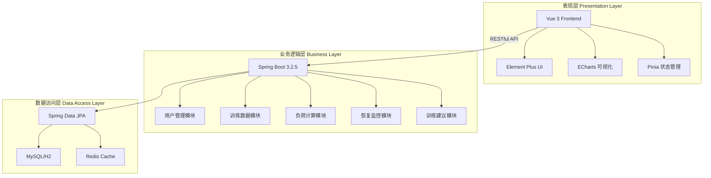
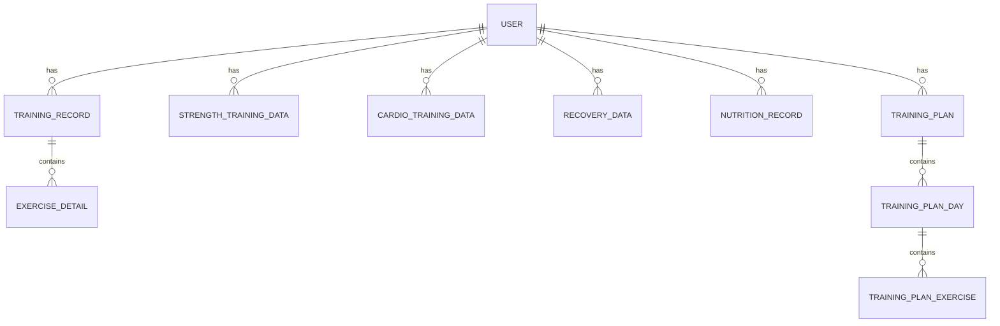

# Design Document: 健身管理系统项目评价与整合

## Overview

本设计文档对「基于Spring Boot的力量训练负荷与恢复监控系统」进行全面的技术评价和整合分析。该系统是一个专注于力量训练的智能化负荷计算与恢复监控平台，采用Spring Boot 3.2.5 + Vue 3技术栈，实现了用户管理、训练数据管理、负荷计算、恢复监控和数据可视化等核心功能。

## Architecture

### 当前架构评价



### 架构优势

1. **前后端分离**: 清晰的职责划分，便于独立开发和部署
2. **分层架构**: Controller → Service → Repository 三层结构清晰
3. **技术栈现代化**: Spring Boot 3.2.5 + Vue 3 + TypeScript
4. **安全设计**: JWT + Spring Security + BCrypt

### 架构不足

1. **缺少API网关**: 没有统一的API网关层
2. **缓存策略不完善**: Redis配置存在但使用不充分
3. **缺少服务监控**: 没有集成Prometheus/Grafana等监控工具
4. **消息队列缺失**: 没有异步消息处理机制

## Components and Interfaces

### 后端组件评价

| 组件 | 状态 | 评价 |
|------|------|------|
| AuthController | ✅ 完整 | 提供注册、登录、令牌刷新功能 |
| TrainingRecordController | ✅ 完整 | 训练记录CRUD操作 |
| LoadRecoveryController | ✅ 完整 | 负荷计算和恢复评估 |
| NutritionController | ✅ 完整 | 营养记录管理 |
| DashboardController | ✅ 完整 | 仪表盘数据聚合 |
| UserProfileController | ✅ 完整 | 用户资料管理 |

### 前端组件评价

| 组件 | 状态 | 评价 |
|------|------|------|
| Dashboard.vue | ✅ 完整 | 主仪表盘，数据可视化 |
| TrainingData.vue | ✅ 完整 | 训练数据管理 |
| RecoveryStatus.vue | ✅ 完整 | 恢复状态展示 |
| LoadAnalysis.vue | ✅ 完整 | 负荷分析图表 |
| NutritionTracking.vue | ✅ 完整 | 营养追踪 |
| DataVisualization.vue | ✅ 完整 | ECharts图表组件 |

### API接口评价

**优势:**
- RESTful设计规范
- 统一的响应格式（ApiResponse）
- 完整的错误码体系

**不足:**
- 部分接口缺少版本控制
- 缺少API限流机制
- 缺少接口幂等性设计

## Data Models

### 数据库设计评价



### 数据模型优势

1. **范式设计**: 遵循第三范式，减少数据冗余
2. **索引策略**: 关键字段建立了复合索引
3. **外键约束**: 保证数据完整性
4. **审计字段**: created_at等时间戳字段

### 数据模型不足

1. **部分表结构冗余**: fitness_data表与strength_training_data表存在字段重复
2. **缺少软删除**: 没有统一的软删除机制
3. **缺少数据版本控制**: 没有乐观锁机制

## Correctness Properties

*A property is a characteristic or behavior that should hold true across all valid executions of a system-essentially, a formal statement about what the system should do. Properties serve as the bridge between human-readable specifications and machine-verifiable correctness guarantees.*

### Property 1: JWT认证一致性

*For any* 有效的用户凭证，登录后获取的JWT令牌应该能够成功验证并返回正确的用户信息

**Validates: Requirements 1.4, 5.2**

### Property 2: 用户数据隔离

*For any* 已认证用户，只能访问和修改自己的训练数据、恢复数据和营养记录

**Validates: Requirements 2.1, 5.4**

### Property 3: 训练量计算正确性

*For any* 训练记录（重量、组数、次数），计算的训练量应等于 重量 × 组数 × 次数

**Validates: Requirements 2.3**

### Property 4: 1RM估算一致性

*For any* 有效的重量和次数输入，使用不同公式（Epley、Brzycki、Lombardi）计算的1RM值应在合理误差范围内（±15%）

**Validates: Requirements 2.3**

### Property 5: 恢复评分范围

*For any* 恢复数据输入，计算的恢复评分应在0-100范围内，且状态分类应与评分区间一致

**Validates: Requirements 2.4**

### Property 6: 密码加密不可逆

*For any* 用户密码，存储的加密密码不应能够被解密还原为原始密码

**Validates: Requirements 5.1**

### Property 7: 数据完整性约束

*For any* 训练记录删除操作，关联的动作详情应被级联删除

**Validates: Requirements 4.3**

### Property 8: 异常处理统一性

*For any* API请求异常，应返回统一格式的错误响应（包含code、message、data字段）

**Validates: Requirements 3.2**

## Error Handling

### 当前错误处理评价

**优势:**
- GlobalExceptionHandler统一处理异常
- 自定义业务异常（BusinessException、ResourceNotFoundException等）
- 统一的ApiResponse响应格式

**不足:**
- 部分异常信息暴露过多细节
- 缺少异常日志分级
- 缺少异常监控告警

### 建议改进

```java
// 建议添加异常分类处理
@ExceptionHandler(BusinessException.class)
public ApiResponse<Void> handleBusinessException(BusinessException e) {
    log.warn("Business exception: {}", e.getMessage());
    return ApiResponse.error(e.getCode(), e.getMessage());
}

@ExceptionHandler(Exception.class)
public ApiResponse<Void> handleException(Exception e) {
    log.error("Unexpected exception", e);
    // 生产环境不暴露详细错误信息
    return ApiResponse.error(500, "服务器内部错误");
}
```

## Testing Strategy

### 当前测试覆盖评价

| 测试类型 | 状态 | 覆盖范围 |
|---------|------|---------|
| 单元测试 | ⚠️ 部分 | Service层部分覆盖 |
| 集成测试 | ⚠️ 部分 | Controller层部分覆盖 |
| Repository测试 | ✅ 存在 | 数据访问层测试 |
| 配置测试 | ✅ 存在 | 测试配置类完整 |

### 测试改进建议

1. **增加单元测试覆盖**: 核心算法（1RM计算、恢复评分）需要100%覆盖
2. **添加属性测试**: 使用jqwik等库进行属性测试
3. **E2E测试**: 添加端到端测试验证完整流程
4. **性能测试**: 添加JMeter或Gatling性能测试

---

## 项目综合评价

### 评分总览

| 评价维度 | 得分 | 说明 |
|---------|------|------|
| 架构设计 | 8/10 | 分层清晰，但缺少网关和监控 |
| 功能完整性 | 9/10 | 核心功能完整，部分高级功能待完善 |
| 代码质量 | 7/10 | 规范性好，但存在部分冗余 |
| 数据库设计 | 8/10 | 范式设计合理，索引策略完善 |
| 安全性 | 8/10 | 基础安全措施完善，可增强 |
| 性能设计 | 6/10 | 基础配置存在，优化空间大 |
| 文档完整性 | 9/10 | 文档丰富详细 |
| 测试覆盖 | 5/10 | 测试覆盖不足 |
| 前端质量 | 8/10 | 技术栈现代，组件设计合理 |

### 综合评分: 7.6/10

---

## 整合改进建议

### 高优先级改进

1. **增加测试覆盖率**
   - 核心算法单元测试
   - API集成测试
   - 目标覆盖率: 80%+

2. **性能优化**
   - 完善Redis缓存策略
   - 添加数据库查询优化
   - 实现API响应压缩

3. **安全增强**
   - 添加API限流
   - 实现登录失败锁定
   - 添加敏感操作日志

### 中优先级改进

4. **代码重构**
   - 合并冗余数据表
   - 统一异常处理
   - 添加软删除机制

5. **监控告警**
   - 集成Prometheus
   - 添加Grafana仪表盘
   - 配置异常告警

6. **API优化**
   - 添加API版本控制
   - 实现接口幂等性
   - 完善API文档

### 低优先级改进

7. **架构演进**
   - 添加API网关
   - 引入消息队列
   - 支持微服务拆分

8. **功能扩展**
   - 移动端适配优化
   - 智能设备集成
   - 社交功能模块
