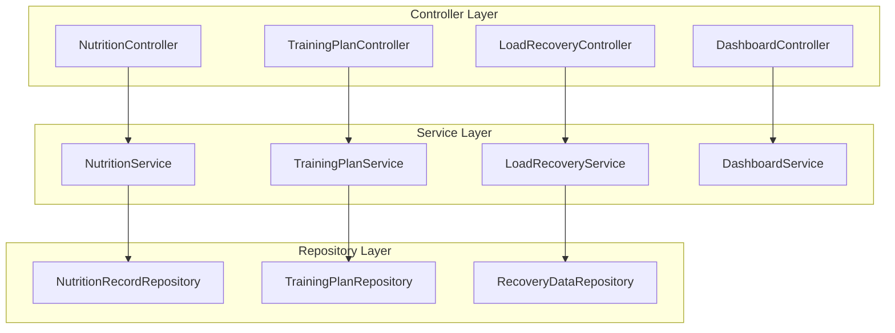
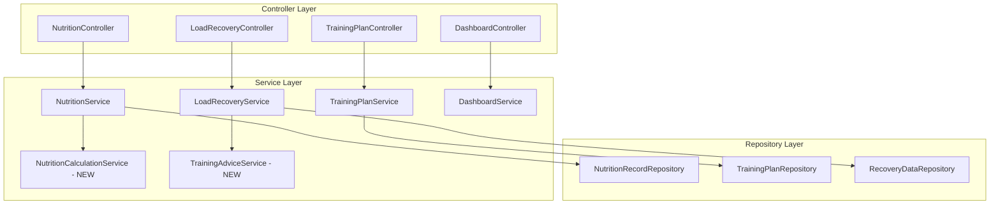

# Design Document: 健身管理系统后端短期改进

## Overview

本设计文档详细描述健身管理系统后端短期改进的技术方案，重点关注营养服务增强、训练计划完善、恢复评估优化等核心功能的实现。

## Architecture

### 当前架构



### 改进后架构



## Components and Interfaces

### 营养计算服务 (NutritionCalculationService)

新增服务，负责营养相关的计算逻辑：

```java
public interface NutritionCalculationService {
    // 根据用户体重和训练目标计算推荐营养摄入
    NutritionRecommendation calculateRecommendedIntake(User user, String trainingGoal);
    
    // 计算营养摄入趋势
    NutritionTrend calculateNutritionTrend(User user, LocalDate startDate, LocalDate endDate);
    
    // 检查营养摄入是否达标
    NutritionStatus checkNutritionStatus(User user, LocalDate date);
    
    // 生成个性化营养建议
    List<NutritionAdvice> generatePersonalizedAdvice(User user, NutritionStatsResponse stats);
}
```

### 营养推荐DTO

```java
@Data
public class NutritionRecommendation {
    private Double recommendedCalories;
    private Double recommendedProtein;
    private Double recommendedCarbs;
    private Double recommendedFat;
    private String trainingGoal;
    private Double bodyWeight;
    private String activityLevel;
}
```

### 营养趋势DTO

```java
@Data
public class NutritionTrend {
    private LocalDate startDate;
    private LocalDate endDate;
    private Double averageCalories;
    private Double averageProtein;
    private Double averageCarbs;
    private Double averageFat;
    private Double caloriesTrend; // 正数表示上升趋势
    private Double proteinTrend;
    private List<DailyNutritionSummary> dailySummaries;
}
```

## Data Models

### 用户营养目标表 (user_nutrition_goals)

```sql
CREATE TABLE user_nutrition_goals (
    id BIGINT AUTO_INCREMENT PRIMARY KEY,
    user_id BIGINT NOT NULL,
    training_goal VARCHAR(50), -- fat_loss, muscle_gain, maintenance
    activity_level VARCHAR(20), -- sedentary, light, moderate, active, very_active
    target_calories DOUBLE,
    target_protein DOUBLE,
    target_carbs DOUBLE,
    target_fat DOUBLE,
    created_at TIMESTAMP DEFAULT CURRENT_TIMESTAMP,
    updated_at TIMESTAMP DEFAULT CURRENT_TIMESTAMP ON UPDATE CURRENT_TIMESTAMP,
    FOREIGN KEY (user_id) REFERENCES users(id)
);
```

## Correctness Properties

*A property is a characteristic or behavior that should hold true across all valid executions of a system.*

### Property 1: 营养推荐计算一致性

*For any* 用户体重和训练目标，计算的推荐蛋白质摄入应在体重的1.6-2.2倍（克/公斤）范围内

**Validates: Requirements 2.2**

### Property 2: 营养摄入总量正确性

*For any* 日期的营养统计，总卡路里应等于所有记录卡路里之和

**Validates: Requirements 2.1**

### Property 3: 营养素占比计算正确性

*For any* 营养统计，蛋白质、碳水、脂肪的卡路里占比之和应接近100%（允许±5%误差）

**Validates: Requirements 2.3**

### Property 4: 营养建议相关性

*For any* 营养摄入不足的情况，系统应生成相应的补充建议

**Validates: Requirements 2.4, 2.5**

## Error Handling

### 营养数据验证错误

```java
// 验证失败时返回详细错误信息
if (request.getCalories() < 0) {
    throw new ValidationException("卡路里不能为负数");
}
if (request.getProtein() != null && request.getProtein() < 0) {
    throw new ValidationException("蛋白质不能为负数");
}
```

### 数据范围验证

```java
// 合理性校验
if (request.getCalories() > 10000) {
    throw new ValidationException("单次卡路里摄入超出合理范围（最大10000）");
}
```

## Testing Strategy

### 单元测试

- NutritionCalculationService 的所有计算方法
- 营养推荐算法的边界条件
- 趋势计算的正确性

### 属性测试

使用 jqwik 框架进行属性测试：

```java
@Property
void recommendedProteinShouldBeInRange(@ForAll @DoubleRange(min = 40, max = 150) double bodyWeight) {
    NutritionRecommendation recommendation = service.calculateRecommendedIntake(
        createUserWithWeight(bodyWeight), "muscle_gain");
    
    double minProtein = bodyWeight * 1.6;
    double maxProtein = bodyWeight * 2.2;
    
    assertThat(recommendation.getRecommendedProtein())
        .isBetween(minProtein, maxProtein);
}
```

### 集成测试

- API 端点的完整流程测试
- 数据库操作的事务测试
