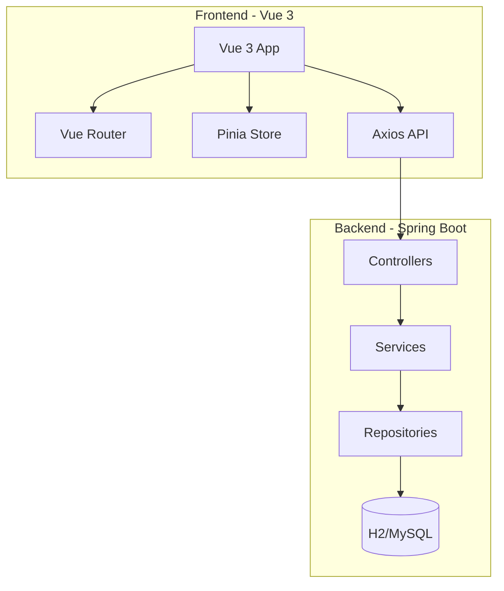
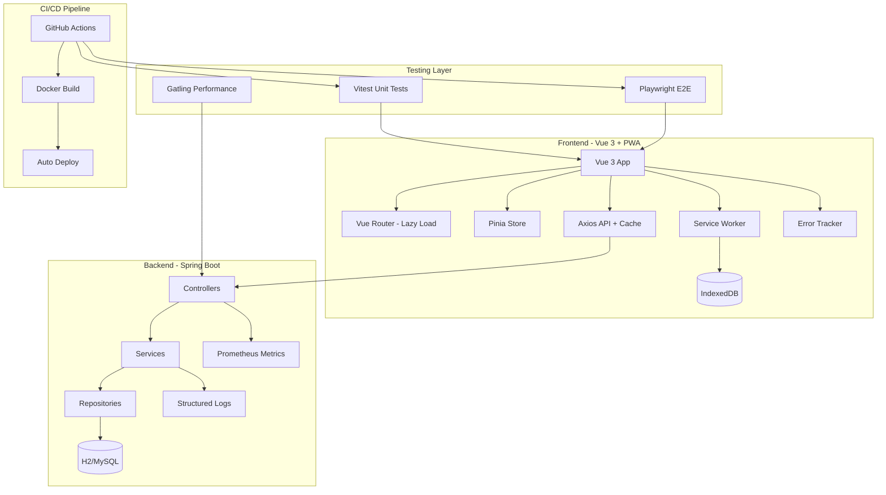

# Design Document: 健身管理系统第二阶段优化

## Overview

本设计文档详细描述健身管理系统第二阶段优化的技术方案，重点关注前端测试体系建设、性能优化、PWA支持、CI/CD流水线和监控增强等核心改进。

## Architecture

### 当前架构



### 优化后架构



## Components and Interfaces

### 1. 前端测试框架配置

#### Vitest配置 (vitest.config.js)

```javascript
import { defineConfig } from 'vitest/config'
import vue from '@vitejs/plugin-vue'

export default defineConfig({
  plugins: [vue()],
  test: {
    environment: 'jsdom',
    globals: true,
    coverage: {
      provider: 'v8',
      reporter: ['text', 'json', 'html'],
      exclude: ['node_modules/', 'tests/'],
      thresholds: {
        lines: 60,
        functions: 60,
        branches: 60,
        statements: 60
      }
    }
  }
})
```

#### Playwright配置 (playwright.config.js)

```javascript
import { defineConfig, devices } from '@playwright/test'

export default defineConfig({
  testDir: './e2e',
  fullyParallel: true,
  forbidOnly: !!process.env.CI,
  retries: process.env.CI ? 2 : 0,
  workers: process.env.CI ? 1 : undefined,
  reporter: [['html'], ['json', { outputFile: 'test-results.json' }]],
  use: {
    baseURL: 'http://localhost:5173',
    trace: 'on-first-retry',
    screenshot: 'only-on-failure',
    video: 'retain-on-failure'
  },
  projects: [
    { name: 'chromium', use: { ...devices['Desktop Chrome'] } },
    { name: 'Mobile Chrome', use: { ...devices['Pixel 5'] } }
  ]
})
```

### 2. PWA Service Worker

#### Service Worker注册 (registerSW.js)

```javascript
export function registerServiceWorker() {
  if ('serviceWorker' in navigator) {
    window.addEventListener('load', () => {
      navigator.serviceWorker.register('/sw.js')
        .then(registration => {
          console.log('SW registered:', registration.scope)
        })
        .catch(error => {
          console.log('SW registration failed:', error)
        })
    })
  }
}
```

#### 离线数据存储接口

```javascript
// offlineStorage.js
export interface OfflineStorage {
  // 保存离线数据
  saveOfflineData(key: string, data: any): Promise<void>
  
  // 获取离线数据
  getOfflineData(key: string): Promise<any>
  
  // 获取待同步数据
  getPendingSyncData(): Promise<SyncItem[]>
  
  // 标记数据已同步
  markAsSynced(id: string): Promise<void>
  
  // 清除已同步数据
  clearSyncedData(): Promise<void>
}

export interface SyncItem {
  id: string
  type: 'training' | 'nutrition' | 'recovery'
  action: 'create' | 'update' | 'delete'
  data: any
  timestamp: number
}
```

### 3. API缓存策略

```javascript
// apiCache.js
export const cacheConfig = {
  // 缓存策略配置
  strategies: {
    // 仪表盘数据 - 5分钟缓存
    dashboard: { ttl: 5 * 60 * 1000, staleWhileRevalidate: true },
    // 用户信息 - 10分钟缓存
    userProfile: { ttl: 10 * 60 * 1000, staleWhileRevalidate: true },
    // 训练记录列表 - 2分钟缓存
    trainingRecords: { ttl: 2 * 60 * 1000, staleWhileRevalidate: true },
    // 营养目标 - 30分钟缓存
    nutritionGoals: { ttl: 30 * 60 * 1000, staleWhileRevalidate: false }
  }
}
```

### 4. CI/CD流水线配置

#### GitHub Actions工作流 (.github/workflows/ci.yml)

```yaml
name: CI/CD Pipeline

on:
  push:
    branches: [main, develop]
  pull_request:
    branches: [main]

jobs:
  test-frontend:
    runs-on: ubuntu-latest
    steps:
      - uses: actions/checkout@v4
      - uses: actions/setup-node@v4
        with:
          node-version: '18'
          cache: 'npm'
          cache-dependency-path: Fitness/frontend/package-lock.json
      - run: npm ci
        working-directory: Fitness/frontend
      - run: npm run test:unit
        working-directory: Fitness/frontend
      - run: npm run test:e2e
        working-directory: Fitness/frontend

  test-backend:
    runs-on: ubuntu-latest
    steps:
      - uses: actions/checkout@v4
      - uses: actions/setup-java@v4
        with:
          java-version: '17'
          distribution: 'temurin'
          cache: 'maven'
      - run: mvn test
        working-directory: Fitness

  build:
    needs: [test-frontend, test-backend]
    runs-on: ubuntu-latest
    steps:
      - uses: actions/checkout@v4
      - name: Build Docker Image
        run: docker build -t fitness-app .
        working-directory: Fitness
```

### 5. 性能测试配置

#### Gatling测试脚本 (ApiPerformanceSimulation.scala)

```scala
class ApiPerformanceSimulation extends Simulation {
  val httpProtocol = http
    .baseUrl("http://localhost:8080")
    .acceptHeader("application/json")
    .contentTypeHeader("application/json")

  val authScenario = scenario("Authentication")
    .exec(http("Login")
      .post("/api/v1/auth/login")
      .body(StringBody("""{"username":"test","password":"test123"}"""))
      .check(status.is(200))
      .check(jsonPath("$.data.token").saveAs("token")))

  val dashboardScenario = scenario("Dashboard")
    .exec(http("Get Dashboard")
      .get("/api/v1/dashboard/overview")
      .header("Authorization", "Bearer ${token}")
      .check(status.is(200))
      .check(responseTimeInMillis.lt(500)))

  setUp(
    authScenario.inject(rampUsers(100).during(60)),
    dashboardScenario.inject(rampUsers(100).during(60))
  ).protocols(httpProtocol)
   .assertions(
     global.responseTime.mean.lt(500),
     global.successfulRequests.percent.gt(95)
   )
}
```

## Data Models

### 离线同步队列表 (IndexedDB)

```javascript
// IndexedDB Schema
const dbSchema = {
  name: 'FitnessOfflineDB',
  version: 1,
  stores: {
    syncQueue: {
      keyPath: 'id',
      indexes: [
        { name: 'type', keyPath: 'type' },
        { name: 'timestamp', keyPath: 'timestamp' },
        { name: 'synced', keyPath: 'synced' }
      ]
    },
    cachedData: {
      keyPath: 'key',
      indexes: [
        { name: 'expiry', keyPath: 'expiry' }
      ]
    }
  }
}
```

### 前端错误日志模型

```typescript
interface ErrorLog {
  id: string
  timestamp: Date
  type: 'error' | 'warning' | 'info'
  message: string
  stack?: string
  componentName?: string
  userId?: number
  url: string
  userAgent: string
  metadata?: Record<string, any>
}
```

## Correctness Properties

*A property is a characteristic or behavior that should hold true across all valid executions of a system.*

### Property 1: API响应时间性能

*For any* 主要API端点，在100并发用户负载下，平均响应时间应低于500毫秒

**Validates: Requirements 5.5**

### Property 2: 离线数据同步完整性

*For any* 离线录入的训练数据，在网络恢复后同步到服务器，同步后的数据应与离线录入的数据完全一致

**Validates: Requirements 4.3, 4.5**

### Property 3: 缓存数据一致性

*For any* 被缓存的API响应，在缓存有效期内返回的数据应与原始响应一致；缓存过期后应返回最新数据

**Validates: Requirements 3.4**

## Error Handling

### 前端错误处理

```javascript
// errorHandler.js
export function setupErrorHandler(app) {
  // Vue错误处理
  app.config.errorHandler = (err, instance, info) => {
    console.error('Vue Error:', err)
    reportError({
      type: 'vue-error',
      message: err.message,
      stack: err.stack,
      componentName: instance?.$options?.name,
      info
    })
  }

  // 全局未捕获错误
  window.addEventListener('error', (event) => {
    reportError({
      type: 'uncaught-error',
      message: event.message,
      filename: event.filename,
      lineno: event.lineno,
      colno: event.colno
    })
  })

  // Promise rejection
  window.addEventListener('unhandledrejection', (event) => {
    reportError({
      type: 'unhandled-rejection',
      message: event.reason?.message || String(event.reason),
      stack: event.reason?.stack
    })
  })
}
```

### 离线同步错误处理

```javascript
// syncErrorHandler.js
export async function handleSyncError(syncItem, error) {
  const maxRetries = 3
  
  if (syncItem.retryCount < maxRetries) {
    // 增加重试计数并延迟重试
    await updateSyncItem({
      ...syncItem,
      retryCount: syncItem.retryCount + 1,
      lastError: error.message,
      nextRetry: Date.now() + exponentialBackoff(syncItem.retryCount)
    })
  } else {
    // 标记为失败，需要用户干预
    await markSyncFailed(syncItem.id, error.message)
    notifyUser('数据同步失败，请检查网络后重试')
  }
}
```

## Testing Strategy

### 单元测试（Vitest）

- 工具函数测试：日期处理、数据格式化、验证函数
- Store测试：Pinia状态管理的actions和getters
- 组件测试：关键Vue组件的渲染和交互
- 目标覆盖率：60%以上

### 端到端测试（Playwright）

- 用户认证流程：登录、注册、登出
- 训练数据管理：录入、查看、编辑、删除
- 营养记录管理：添加记录、查看统计
- 仪表盘展示：数据加载、图表渲染
- 移动端适配：响应式布局验证

### 性能测试（Gatling）

- 负载测试：100并发用户
- 压力测试：逐步增加负载直到系统极限
- 耐久测试：持续负载下的稳定性
- 关键指标：响应时间、吞吐量、错误率

### 属性测试

使用Vitest的属性测试能力验证：
- API缓存一致性
- 离线数据同步完整性

```javascript
// 示例：缓存一致性属性测试
import { fc } from '@fast-check/vitest'

test.prop([fc.string(), fc.json()])('缓存数据应与原始数据一致', 
  async (key, data) => {
    await cache.set(key, data)
    const cached = await cache.get(key)
    expect(cached).toEqual(data)
  }
)
```

