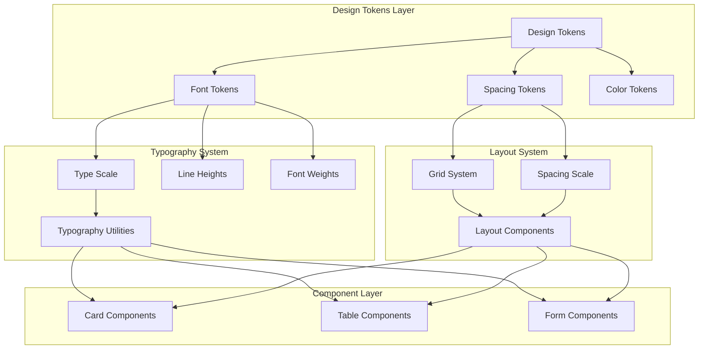

# Design Document: Typography and Layout Optimization

## Overview

本设计文档定义了 Fitness 健身管理系统前端的字体排版系统和内容布局优化方案。通过建立统一的设计令牌（Design Tokens）、模块化的排版比例和响应式布局系统，提升整体用户体验和代码可维护性。

## Architecture

### 设计系统架构



### 文件结构

```
Fitness/frontend/src/assets/styles/
├── _tokens.scss          # 设计令牌定义
├── _typography.scss      # 排版系统样式
├── _spacing.scss         # 间距系统样式
├── _grid.scss            # 网格布局系统
├── variables.scss        # 现有变量（更新）
├── base.scss             # 基础样式（更新）
└── components.scss       # 组件样式（更新）
```

## Components and Interfaces

### 1. 设计令牌接口

```scss
// _tokens.scss - Design Tokens Interface

// Font Family Tokens
$font-family-sans: -apple-system, BlinkMacSystemFont, 'Segoe UI', 'PingFang SC', 
                   'Hiragino Sans GB', 'Microsoft YaHei', 'Helvetica Neue', 
                   Helvetica, Arial, sans-serif;
$font-family-mono: 'SF Mono', 'Fira Code', 'Fira Mono', Menlo, Monaco, 
                   'Courier New', monospace;

// Type Scale Tokens (1.25 ratio - Major Third)
$font-size-2xs: 0.64rem;   // 10.24px
$font-size-xs: 0.8rem;     // 12.8px
$font-size-sm: 0.875rem;   // 14px
$font-size-base: 1rem;     // 16px
$font-size-lg: 1.125rem;   // 18px
$font-size-xl: 1.25rem;    // 20px
$font-size-2xl: 1.5rem;    // 24px
$font-size-3xl: 1.875rem;  // 30px
$font-size-4xl: 2.25rem;   // 36px
$font-size-5xl: 3rem;      // 48px

// Line Height Tokens
$line-height-none: 1;
$line-height-tight: 1.25;
$line-height-snug: 1.375;
$line-height-normal: 1.5;
$line-height-relaxed: 1.625;
$line-height-loose: 1.75;

// Font Weight Tokens
$font-weight-light: 300;
$font-weight-normal: 400;
$font-weight-medium: 500;
$font-weight-semibold: 600;
$font-weight-bold: 700;
$font-weight-extrabold: 800;

// Letter Spacing Tokens
$letter-spacing-tighter: -0.05em;
$letter-spacing-tight: -0.025em;
$letter-spacing-normal: 0;
$letter-spacing-wide: 0.025em;
$letter-spacing-wider: 0.05em;

// Spacing Scale Tokens (4px base unit)
$spacing-0: 0;
$spacing-1: 0.25rem;   // 4px
$spacing-2: 0.5rem;    // 8px
$spacing-3: 0.75rem;   // 12px
$spacing-4: 1rem;      // 16px
$spacing-5: 1.25rem;   // 20px
$spacing-6: 1.5rem;    // 24px
$spacing-8: 2rem;      // 32px
$spacing-10: 2.5rem;   // 40px
$spacing-12: 3rem;     // 48px
$spacing-16: 4rem;     // 64px
```

### 2. 排版系统接口

```scss
// _typography.scss - Typography System Interface

// Heading Styles Mixin
@mixin heading-1 {
  font-size: $font-size-4xl;
  font-weight: $font-weight-extrabold;
  line-height: $line-height-tight;
  letter-spacing: $letter-spacing-tight;
}

@mixin heading-2 {
  font-size: $font-size-3xl;
  font-weight: $font-weight-bold;
  line-height: $line-height-tight;
  letter-spacing: $letter-spacing-tight;
}

@mixin heading-3 {
  font-size: $font-size-2xl;
  font-weight: $font-weight-semibold;
  line-height: $line-height-snug;
}

@mixin heading-4 {
  font-size: $font-size-xl;
  font-weight: $font-weight-semibold;
  line-height: $line-height-snug;
}

// Body Text Mixin
@mixin body-text($size: 'base') {
  @if $size == 'sm' {
    font-size: $font-size-sm;
    line-height: $line-height-normal;
  } @else if $size == 'lg' {
    font-size: $font-size-lg;
    line-height: $line-height-relaxed;
  } @else {
    font-size: $font-size-base;
    line-height: $line-height-relaxed;
  }
}

// Fluid Typography Mixin
@mixin fluid-type($min-size, $max-size, $min-vw: 320px, $max-vw: 1200px) {
  font-size: clamp(#{$min-size}, calc(#{$min-size} + (#{strip-unit($max-size - $min-size)}) * ((100vw - #{$min-vw}) / #{strip-unit($max-vw - $min-vw)})), #{$max-size});
}
```

### 3. 布局系统接口

```scss
// _grid.scss - Grid System Interface

// Grid Container
@mixin grid-container($columns: 12, $gap: $spacing-6) {
  display: grid;
  grid-template-columns: repeat($columns, 1fr);
  gap: $gap;
}

// Auto-fit Grid for Cards
@mixin auto-grid($min-width: 280px, $gap: $spacing-5) {
  display: grid;
  grid-template-columns: repeat(auto-fit, minmax($min-width, 1fr));
  gap: $gap;
}

// Content Container with Max Width
@mixin content-container($max-width: 75ch) {
  max-width: $max-width;
  margin-inline: auto;
  padding-inline: $spacing-4;
  
  @media (min-width: 768px) {
    padding-inline: $spacing-6;
  }
}

// Section Spacing
@mixin section-spacing {
  margin-bottom: $spacing-8;
  
  @media (min-width: 768px) {
    margin-bottom: $spacing-12;
  }
}
```

### 4. 间距系统接口

```scss
// _spacing.scss - Spacing System Interface

// Semantic Spacing Tokens
$spacing-tight: $spacing-2;      // 8px - 紧凑间距
$spacing-normal: $spacing-4;     // 16px - 标准间距
$spacing-loose: $spacing-6;      // 24px - 宽松间距
$spacing-section: $spacing-8;    // 32px - 区块间距

// Card Internal Spacing
$card-padding-sm: $spacing-4;    // 16px
$card-padding-md: $spacing-5;    // 20px
$card-padding-lg: $spacing-6;    // 24px

// Form Field Spacing
$form-field-gap: $spacing-4;     // 16px
$form-group-gap: $spacing-6;     // 24px

// Table Cell Padding
$table-cell-padding-y: $spacing-3;  // 12px
$table-cell-padding-x: $spacing-4;  // 16px
```

## Data Models

### 排版配置数据模型

```typescript
// Typography Configuration Model
interface TypographyConfig {
  fontFamily: {
    sans: string;
    mono: string;
  };
  typeScale: {
    [key: string]: string; // '2xs' | 'xs' | 'sm' | 'base' | 'lg' | 'xl' | '2xl' | '3xl' | '4xl' | '5xl'
  };
  lineHeight: {
    [key: string]: number; // 'none' | 'tight' | 'snug' | 'normal' | 'relaxed' | 'loose'
  };
  fontWeight: {
    [key: string]: number; // 'light' | 'normal' | 'medium' | 'semibold' | 'bold' | 'extrabold'
  };
  letterSpacing: {
    [key: string]: string; // 'tighter' | 'tight' | 'normal' | 'wide' | 'wider'
  };
}

// Spacing Configuration Model
interface SpacingConfig {
  scale: {
    [key: number]: string; // 0, 1, 2, 3, 4, 5, 6, 8, 10, 12, 16
  };
  semantic: {
    tight: string;
    normal: string;
    loose: string;
    section: string;
  };
}

// Breakpoint Configuration Model
interface BreakpointConfig {
  sm: string;  // 640px
  md: string;  // 768px
  lg: string;  // 1024px
  xl: string;  // 1280px
  '2xl': string; // 1536px
}
```

### 响应式断点配置

```scss
// Breakpoint Variables
$breakpoint-sm: 640px;
$breakpoint-md: 768px;
$breakpoint-lg: 1024px;
$breakpoint-xl: 1280px;
$breakpoint-2xl: 1536px;

// Responsive Typography Scale
$responsive-type-scale: (
  'mobile': (
    'base': 14px,
    'lg': 16px,
    'xl': 18px,
    '2xl': 22px,
    '3xl': 26px,
    '4xl': 32px
  ),
  'tablet': (
    'base': 15px,
    'lg': 17px,
    'xl': 19px,
    '2xl': 23px,
    '3xl': 28px,
    '4xl': 34px
  ),
  'desktop': (
    'base': 16px,
    'lg': 18px,
    'xl': 20px,
    '2xl': 24px,
    '3xl': 30px,
    '4xl': 36px
  )
);
```


## Correctness Properties

*A property is a characteristic or behavior that should hold true across all valid executions of a system—essentially, a formal statement about what the system should do. Properties serve as the bridge between human-readable specifications and machine-verifiable correctness guarantees.*


Based on the prework analysis, the following testable properties have been identified:

### Property 1: Type Scale Modular Consistency

*For any* font size token in the Typography_System, the ratio between consecutive sizes should follow a consistent modular scale (approximately 1.125-1.25 ratio).

**Validates: Requirements 1.1**

### Property 2: Heading Font Weight Range

*For any* heading element (h1-h4), the computed font-weight value should be between 600 and 800 inclusive.

**Validates: Requirements 1.2**

### Property 3: Body Text Line Height Range

*For any* body text element, the computed line-height value should be between 1.4 and 1.8 inclusive.

**Validates: Requirements 1.3**

### Property 4: Responsive Font Scaling with Minimum

*For any* viewport width and any body text element, the computed font-size should never be less than 14px, and should scale proportionally between breakpoints.

**Validates: Requirements 2.1, 2.2, 2.4**

### Property 5: Visual Hierarchy Ratio Preservation

*For any* pair of heading levels (h1/h2, h2/h3, h3/h4), the font-size ratio between them should remain consistent (within 5% variance) across all viewport widths.

**Validates: Requirements 2.5, 5.4**

### Property 6: Spacing Scale Adherence

*For any* margin or padding value used in the layout, the value should be a member of the defined spacing scale (0, 4px, 8px, 12px, 16px, 20px, 24px, 32px, 40px, 48px, 64px).

**Validates: Requirements 4.1, 4.2, 4.4**

### Property 7: Component Padding Range Compliance

*For any* card component, the internal padding should be between 16px and 28px; for any table cell, vertical padding should be between 12px and 16px; for any form field, vertical spacing should be between 16px and 24px.

**Validates: Requirements 6.1, 6.2, 7.3, 8.2**

### Property 8: Color Contrast WCAG Compliance

*For any* text element and its background, the contrast ratio should be at least 4.5:1 for normal text and 3:1 for large text (18px+ or 14px+ bold).

**Validates: Requirements 5.3**

## Error Handling

### CSS 变量回退策略

```scss
// 为所有 CSS 变量提供回退值
.text-base {
  font-size: var(--font-size-base, 16px);
  line-height: var(--line-height-normal, 1.5);
}

// 响应式回退
@supports not (font-size: clamp(1rem, 2vw, 2rem)) {
  .fluid-text {
    font-size: 1rem;
    
    @media (min-width: 768px) {
      font-size: 1.25rem;
    }
  }
}
```

### 字体加载失败处理

```scss
// 系统字体回退栈确保在自定义字体加载失败时仍有良好显示
$font-family-fallback: -apple-system, BlinkMacSystemFont, 'Segoe UI', 
                       'PingFang SC', 'Microsoft YaHei', sans-serif;

// 字体加载状态处理
.fonts-loading {
  // 使用系统字体避免 FOIT
  font-family: $font-family-fallback;
}

.fonts-loaded {
  font-family: var(--font-family-primary, $font-family-fallback);
}
```

### 布局溢出处理

```scss
// 防止内容溢出
.content-container {
  overflow-wrap: break-word;
  word-wrap: break-word;
  hyphens: auto;
}

// 长文本截断
.text-truncate {
  overflow: hidden;
  text-overflow: ellipsis;
  white-space: nowrap;
}

// 多行截断
.text-clamp {
  display: -webkit-box;
  -webkit-line-clamp: var(--line-clamp, 3);
  -webkit-box-orient: vertical;
  overflow: hidden;
}
```

## Testing Strategy

### 单元测试

单元测试用于验证特定的样式值和边界情况：

1. **CSS 变量存在性测试** - 验证所有必需的设计令牌已定义
2. **字体栈测试** - 验证字体族包含必要的中文字体
3. **断点值测试** - 验证响应式断点值正确定义

### 属性测试

属性测试用于验证跨多种输入的通用属性：

1. **Property 1-8** 将使用 Vitest 配合 CSS 解析库进行测试
2. 每个属性测试运行至少 100 次迭代
3. 测试标签格式: **Feature: typography-layout-optimization, Property N: [property_text]**

### 测试框架配置

```javascript
// vitest.config.js 配置
export default {
  test: {
    // 属性测试配置
    testTimeout: 30000,
    // 最小迭代次数
    fuzz: {
      iterations: 100
    }
  }
}
```

### 视觉回归测试

使用 Playwright 进行视觉回归测试：

1. 截图对比不同断点下的排版效果
2. 验证字体渲染一致性
3. 检查布局在极端内容下的表现

### 可访问性测试

1. 使用 axe-core 验证颜色对比度
2. 验证字体大小符合 WCAG 标准
3. 检查焦点状态可见性
